# 高速崎岖地面轮腿机器人

MuJoCo 里的轮腿研究仓库。原型机是 `models/upkie/upstream/` 里原样放着的 GitHub Upkie：串髋串膝、速度轮、没有柔性髋座、没有四连杆、没有横杆。3 倍轮距小车才是加了菱形四连杆和套筒横杆的改型。

平地垫上 3× 小车极限 **195 km/h**，1× 四连杆改型 **180 km/h**。刚铺的 Unitree 同款 Perlin 长条上完全是另一回事：3× 小车大约 **3.0 m/s（10.8 km/h）**，原版 Upkie 只能在皱面上站住，一爬就翻。

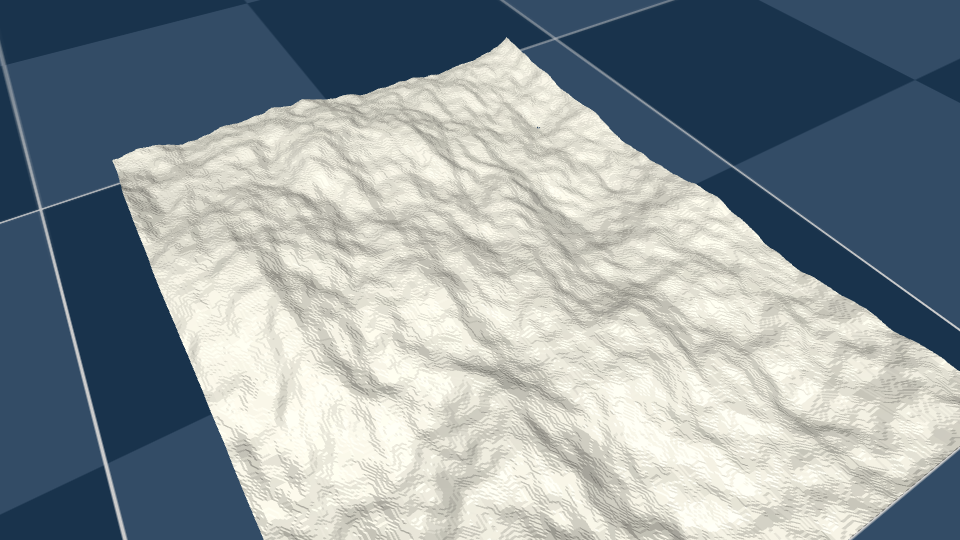

[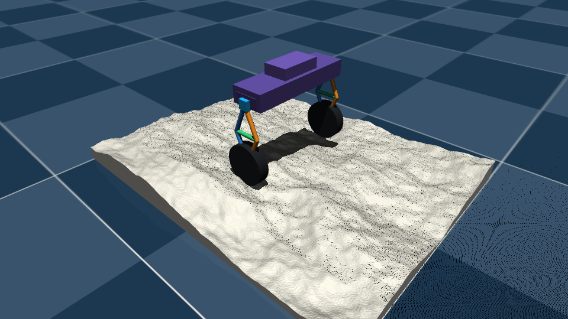](docs/media/unitree_perlin_orbit.mp4)

## 已实现

### Unitree 同款 Perlin 高度场

按 [unitree_mujoco/terrain_tool](https://github.com/unitreerobotics/unitree_mujoco) 里 `AddPerlinHeighField` 的演示调用铺：`size=[2.0, 1.5]`、128 px 图、`smooth=100`、6 层、`height_scale=0.2`。网格加到 384 px，同样的褶皱更细。灰色无纹理，搁在默认蓝棋盘上，侧光把纸皱打出来。

这是一块 2 m × 1.5 m 的毯子，用来看清褶皱，不是用来测速。测速用的是同一套波长/层数/20 cm 起伏、拉成 **48 m × 4 m** 的长条：前 6 m 平地，6–10 m 过渡，10 m 之后全幅皱面。场景在 `models/upkie/high_speed/scene_perlin.xml` 和 `models/upkie/upstream/scene_perlin.xml`。

### Perlin 长条极限速度

两台车用同一条皱面、各自调过的 PID。3× 小车轮毂仍是 ±6 N·m 力矩；原版 Upkie 轮毂是官方速度伺服，`kv=0.05`、`forcerange ±1.7 N·m`，控制上把俯仰 PD 力矩除以 `kv` 再送给速度执行器。髋膝位置环钉在 0，不改 `upstream/robot.xml`。

| | 3× 四连杆小车 | 原版 GitHub Upkie |
| --- | --- | --- |
| 机构 | 菱形四连杆 + 弹性横杆，轮距 682 mm | 串髋串膝，轮距约 227 mm，轮胎半径 55 mm |
| 皱面滚动起步 | **3.0 m/s（10.8 km/h）** 稳住 8 s | 原地可站；**0.25 m/s 即俯仰翻车** |
| 再快一点 | 3.4 m/s 冲出 4 m 宽条带 | 全幅皱面上没有可巡航速度 |
| 从平地加速进皱面 | 2.2 m/s 指令可跑完过渡带并巡航 | 约 0.5 m/s 爬到入口后翻车 |
| 皱面实际巡航 | 指令 3.0 m/s 时约 2.1 m/s（7.7 km/h） | 0 |
| 俯仰 Kp / Kd | 380 / 90 | 24 / 4.0（N·m） |
| 速度 Kp / Ki | 0.055 / 0 | 0.11 / 0.003 |
| 倾角限幅 | 0.09 rad | 0.12 rad |
| 航向 yaw Kp/Kd | 0.55 / 0.22 | 0.22 / 0.07 |
| 横滚 Kp/Kd | 1.6 / 0.35 | 0.70 / 0.12 |

20 cm 起伏、1.56 m 基波长、最大坡度约 29°。没有气动，上限是横滚/冲出赛道，不是电机功率。原版 Upkie 腿是锁死的串联腿，轮子又小，皱面移动时接地面把俯仰直接灌进躯干。

[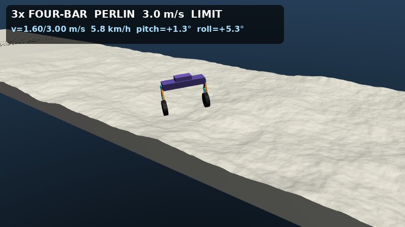](docs/media/wide_perlin_3ms.mp4)

[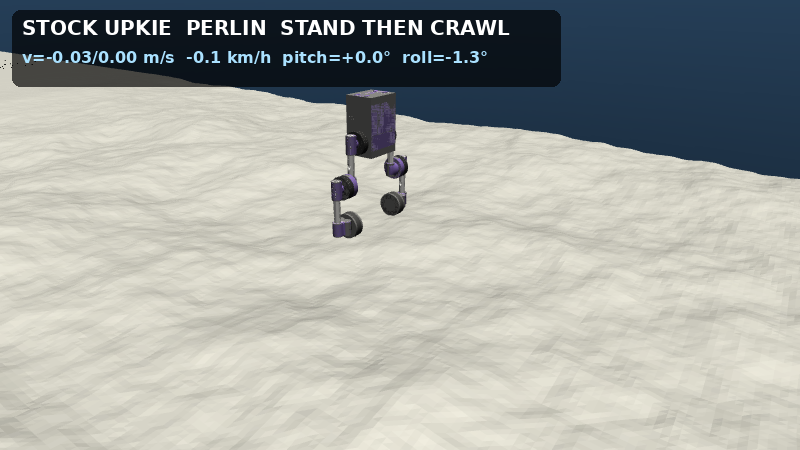](docs/media/upkie_perlin_limit.mp4)

### 菱形四连杆与套筒横杆

左右腿改成前后对称的四连杆，中间是双级伸缩弹性横杆。主动缩短/伸长后切断伺服，机构靠弹簧回中。全伸长时套筒仍保持至少 26 mm 搭接。这是 3× 小车和 1× 四连杆改型的结构，**不是** GitHub 原型机。

[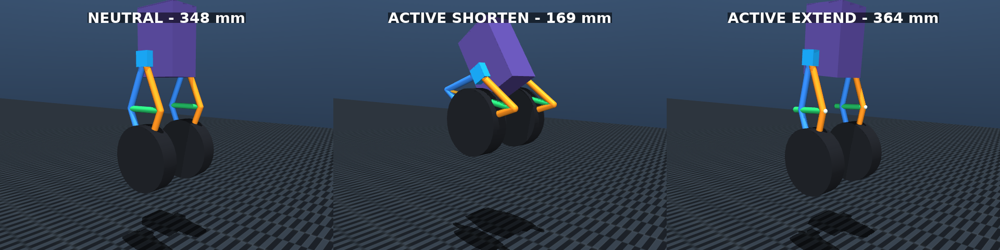](docs/media/four_bar.mp4)

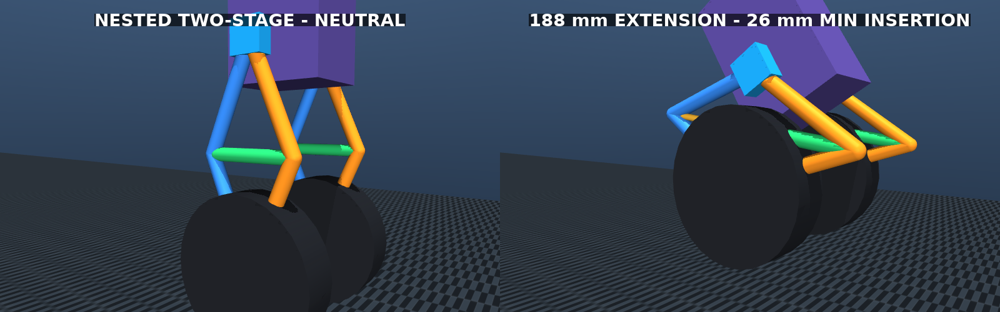

### 分级崎岖路面

按 Unitree 的做法：高度场 + 横向圆木/石块。easy / medium / hard / extreme 四档，前面有平地起飞段。

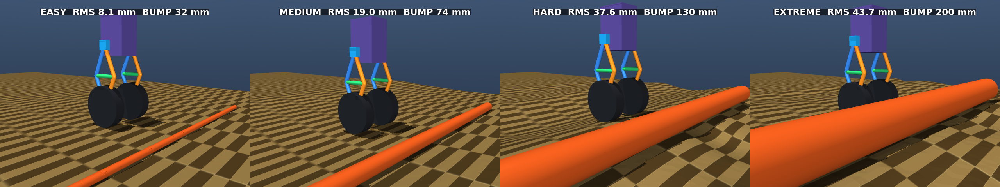

### 平地速度 PID

速度 PI 外环、俯仰 PD 内环，目标倾角带限幅。2.0 m/s（7.2 km/h）可完成加速、巡航、制动。轮毂力矩 ±6 N·m。

[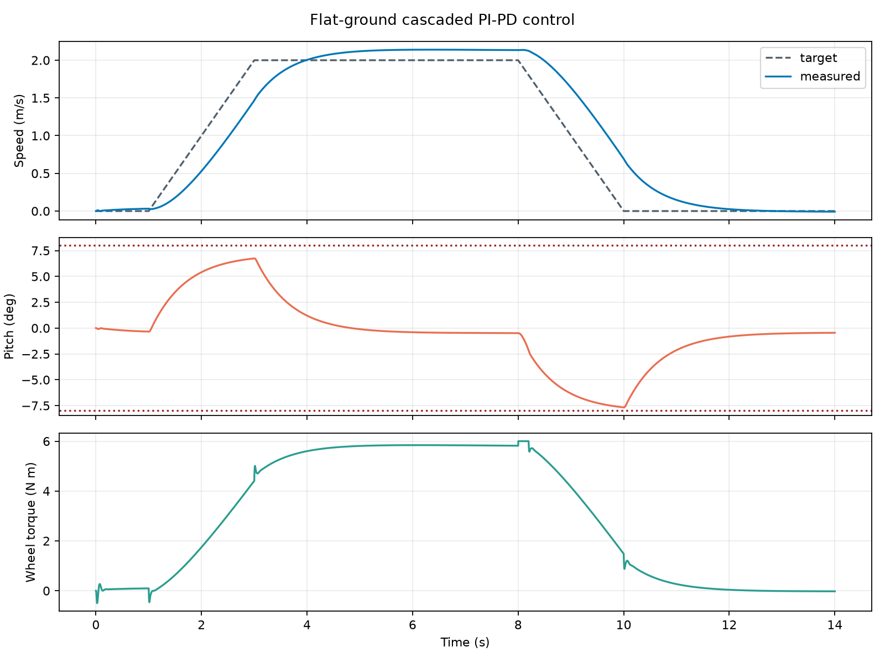](docs/media/flat_balance.mp4)

### 地形联合控制

射线预瞄地面、左右腿独立伸缩、车身高度/横滚反馈。`medium` 地形上 1.5 m/s 通过约 13.7 m。标称可靠速度 10 m/s（36 km/h）。

[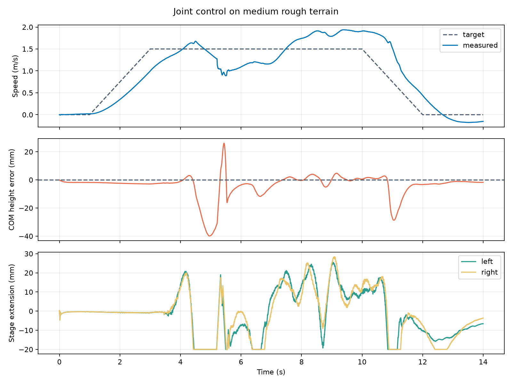](docs/media/joint_control.mp4)

[36 km/h 长赛道](docs/media/high_speed_36kmh.mp4)

### 极限速度（平地垫 PID）

无限棋盘垫、轮毂 ±6 N·m、没有气动阻力。这里的“原型”是 **1× 四连杆改型**，不是 GitHub Upkie。上限是横滚/航向。

| | 3× 轮距小车 | 1× 四连杆改型 |
| --- | --- | --- |
| 轮距 | 682 mm | 227 mm |
| 极限巡航 | **195 km/h** | **180 km/h** |
| 再快一点 | 196 km/h 横滚翻车 | 182 km/h 航向空洞 |
| 俯仰 Kp / Kd | 480 / 70 | 540 / 48 |
| 速度 Kp / Ki | 0.022 / 0 | 0.024 / 0 |
| 倾角限幅 | 0.070 rad | 0.085 rad |
| 航向 yaw Kp/Kd | 0.45 / 0.20 | 0.18 / 0.10 |
| 横滚 Kp/Kd | 5.0 / 0.70 | 7.2 / 1.05 |
| 轮差限幅 | ±0.18 N·m | ±0.10 N·m |

窄车更早介入航向、横滚更硬、轮差更小。两套都能从静止以 0.50 m/s² 拉到各自极限。

[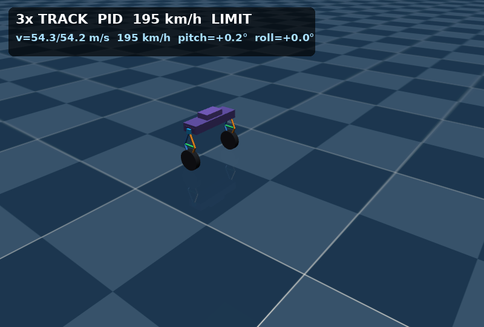](docs/media/wide_car_195kmh.mp4)

[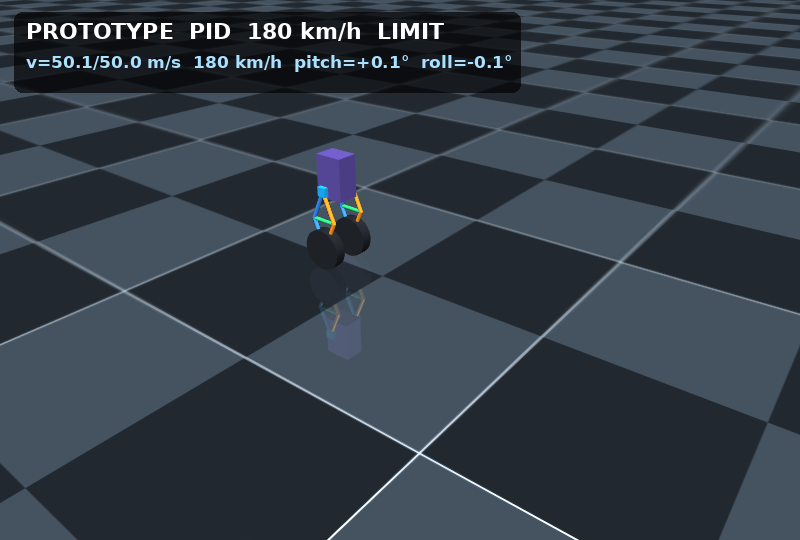](docs/media/prototype_180kmh.mp4)

### 100 km/h（3 倍轮距）

轮距 682 mm、甲板 656 mm。在棋盘起飞垫上 PID 能拉到 **100 km/h** 并巡航满 64 s。Unitree 演示那种 1.56 m 基波长 / 6 层褶皱，3 倍轮距下没法像缓坡那样用同一套 100 km/h PID 巡航。36 km/h 邻域仍在垫上稳定。

[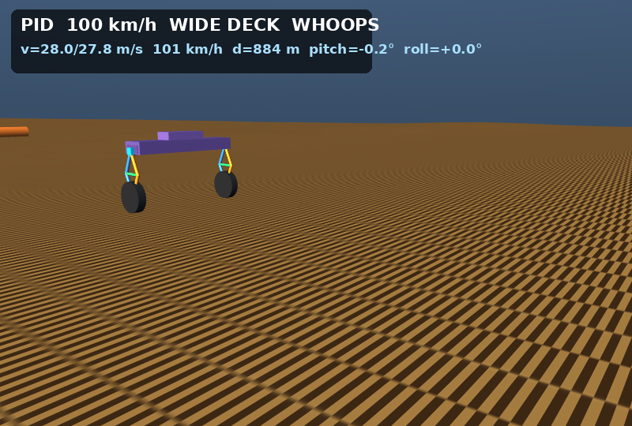](docs/media/high_speed_100kmh.mp4)

连杆仍用 190 mm：站立菱形已有约 174 mm 压缩行程。只加长连杆、不加长横杆，行程会变短。

## 本地运行

需要 Python 3.12 和 [uv](https://docs.astral.sh/uv/)。Linux 无界面渲染再安装 `libosmesa6`。

```bash
uv sync --frozen
uv run python -m mujoco.viewer --mjcf models/upkie/high_speed/scene_perlin.xml
uv run python -m mujoco.viewer --mjcf models/upkie/upstream/scene_perlin.xml
```

重新生成演示：

```bash
uv run python scripts/generate_perlin_track.py
uv run python scripts/generate_high_speed_track.py
uv run python scripts/render_unitree_perlin.py --output-directory docs/media
uv run python scripts/render_perlin_speed.py --output-directory docs/media
uv run python scripts/render_speed_limit.py --output-directory docs/media
uv run python scripts/render_four_bar_demo.py --output-directory docs/media
uv run python scripts/render_high_speed_demo.py --output-directory docs/media
```

核对 Perlin 极限：

```bash
uv run python scripts/verify_perlin_speed.py
```

高速场景在 `models/upkie/high_speed/`，中速四连杆在 `models/upkie/four_bar/`。基线 Upkie 原样放在 `models/upkie/upstream/`，许可见 `models/upkie/UPSTREAM.md`。
